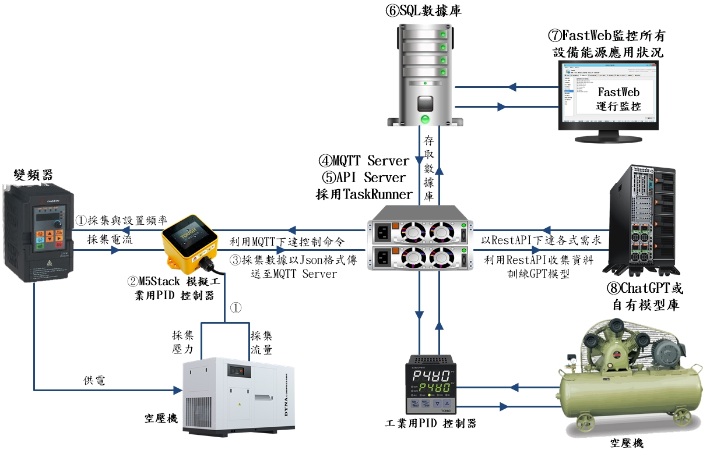
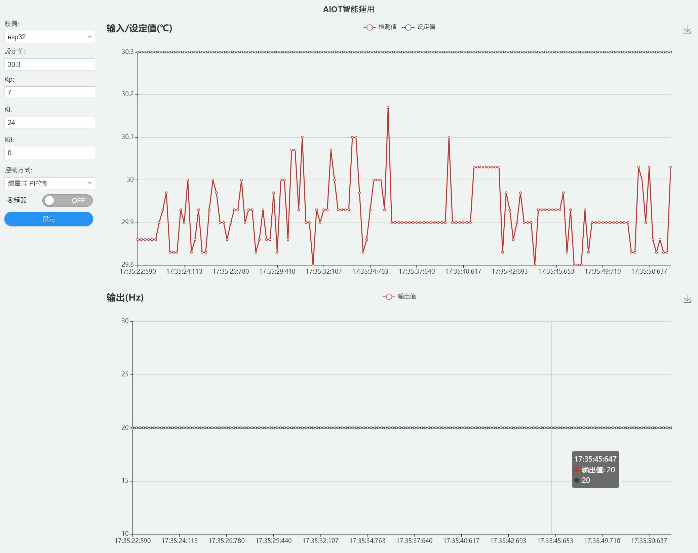
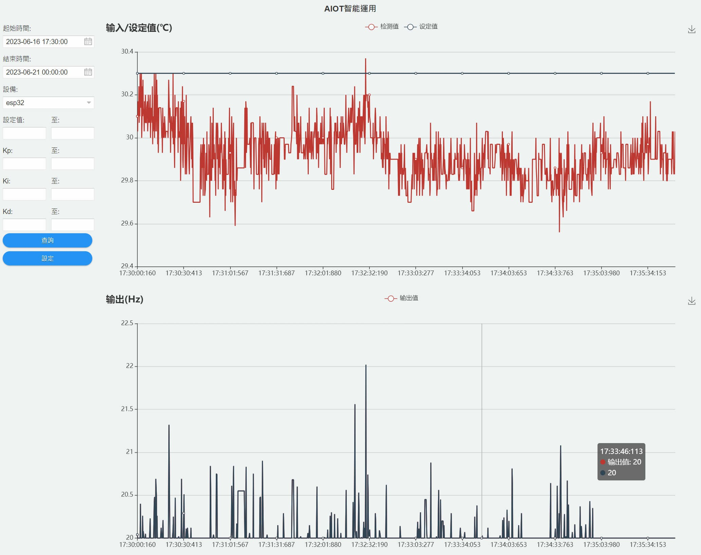
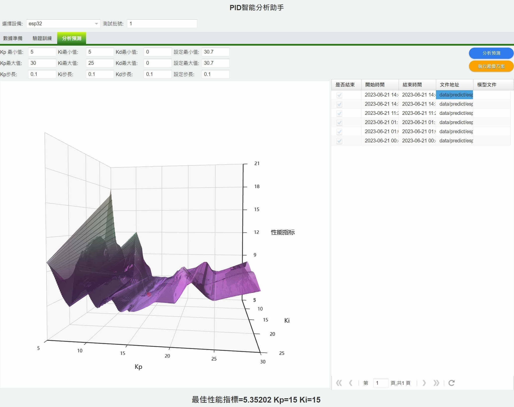
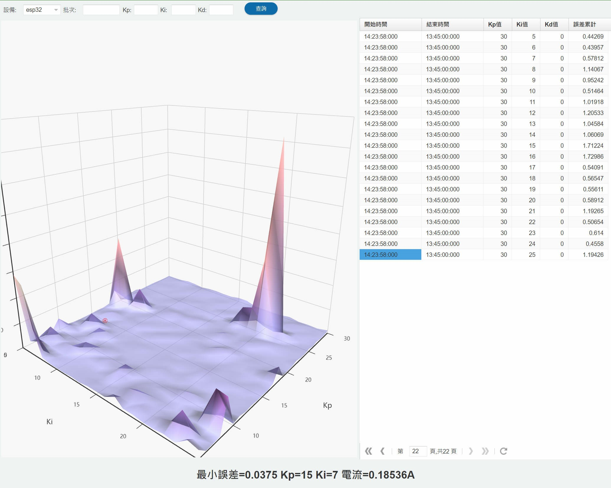
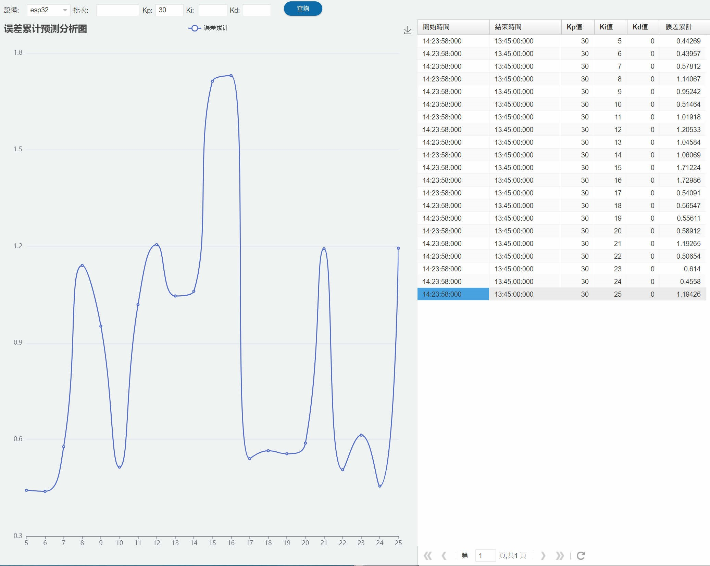
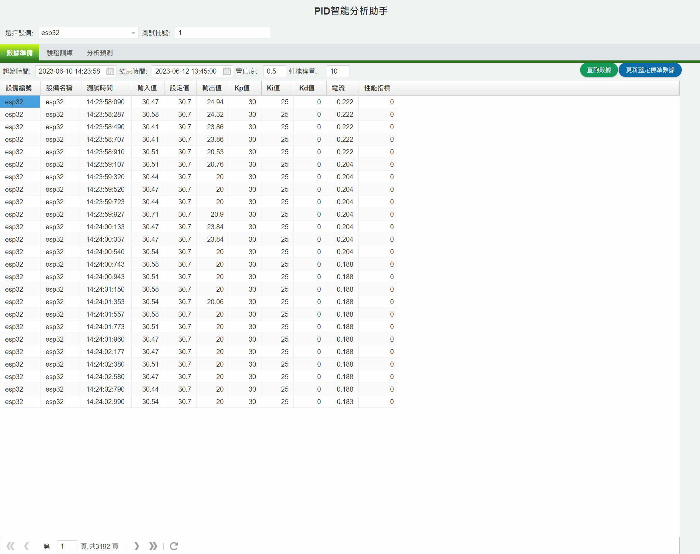
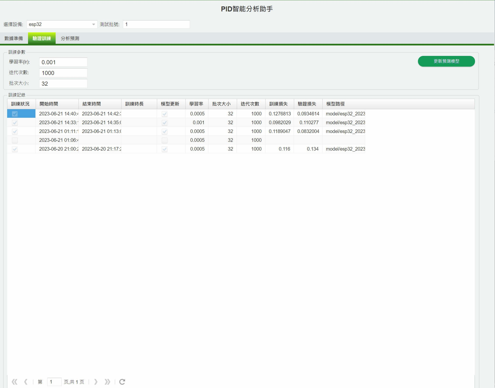
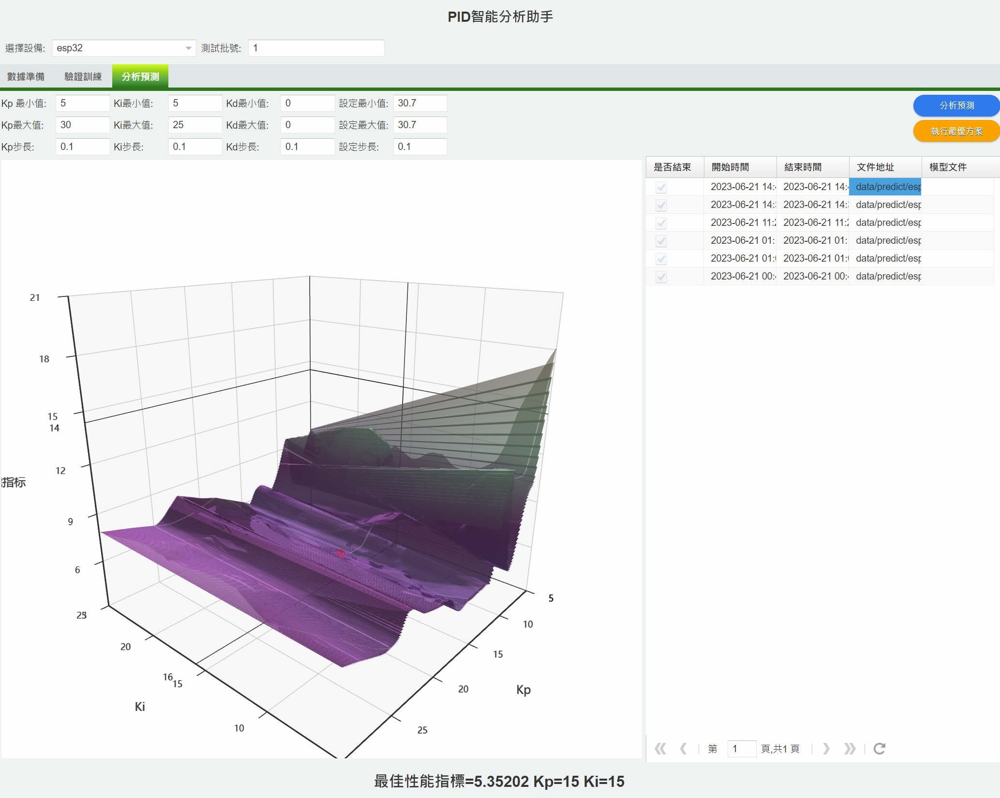

# 設備最佳運轉效益Equipment_effectiveness
採用演算法，取得最佳運轉參數。再利用類神經網路AI模型，制定最佳運轉效能與節能措施，達到負載平衡跟最佳節能的策略

> **加入 Facebook 社團**
>
> [https://www.facebook.com/groups/isoface/](https://www.facebook.com/groups/isoface/)
> 
> **點讚追蹤 Facebook 粉絲專頁**
> 
> [https://www.facebook.com/AIOT.ERP](https://www.facebook.com/AIOT.ERP)

由於自動化設備在各行各業的普及，工廠利用儀錶偵測設備的耗電量、負載、等運轉數據。用以掌握設備運行狀況，降低運轉成本。以空氣壓縮機為例，依照工廠製程類型不同，其耗電量佔全廠耗能約15～60％。現今變頻器技術發展成熟，可有效的依據現場需求改變馬達的轉速，達到真正的『用多少、供多少』的節能理想曲線，但若單純使用外加變頻器來控制，在考量低轉速可能會導致馬達散熱不良的限制下，仍無法完全的符合理想曲線的應用。數控中心採用PID演算法，取得最佳運轉參數。再利用類神經網路AI模型，制定最佳運轉效能與節能措施，達到負載平衡跟最佳節能的策略，『數控中心_設備最佳運轉效益』工作流程如下︰

① 使用 M5Stack(PID控制器)的 Modbus RTU，採集設備相關資料。

② 以PID演算法，改善機台運轉效率。

③ 採集數據以 JSON 格式經由④ MQTT Server，上傳至 ⑥SQL數據庫。

④ MQTT Server 中轉採集數據與控制命令。

⑤ API Server 設置各種運算公式，例如計算能源最佳性能指標，並將數據上傳至 ⑥SQL數據庫。

⑥ SQL數據庫保存所有採集數據與運算結果。

⑦ 使用FastWeb監控所有採集與計算過程，並呈現最終AI運轉結果。

⑧ 使用 ChatGPT 或自有AI模型，以採集數據與運算結果。直接控制設備採用最佳節能作法。

## 『數控中心_設備最佳運轉效益』的特色

採用先進的PID控制演算法，控制機電設備運轉在最佳的狀況，還能保持機電設備能源消耗最低。低電力運轉，不但降低成本，避免電力浪費，有助於減碳排放。

使用最佳性能指標，整合評估(運轉效率＋能源效率)，協助機電設備的降低能源使用量，即時調控設備最佳運轉配置，在不同階段之負載情況中，提高設備使用效率，達成節能減碳效益。

配合PID控制所計算出之參數，訓練類神經網路模型，再利用訓練完成的AI模型，可預測最佳性能指標與相關參數，強化預測速度與準確率。

搭配『數控中心_設備故障保養功能』，使用三軸加速規與溫度感測器，診斷馬達老化現象，做好設備預防保養。

採用Web管理介面，隨時隨地調用圖表，查閱設備即時運行狀況，如有故障立即發送警告訊息。

『數控中心_設備最佳運轉效益』，工作流程如下︰

01_依據儀表量測數據繪製PID即時驅勢圖

02_隨時查閱歷史數據繪製PID歷史驅勢圖

03_依據量測數據進行PID演算，求出參數值

04_計算能源利用的最佳性能指標

05_使用PID演算進行誤差分析

06_使用PID演算，進行誤差累計預測分析

07_為AI模型，準備訓練數據

08_AI模型訓練完成，驗證結果

09_利用AI模型進行智能分析，預測參數

